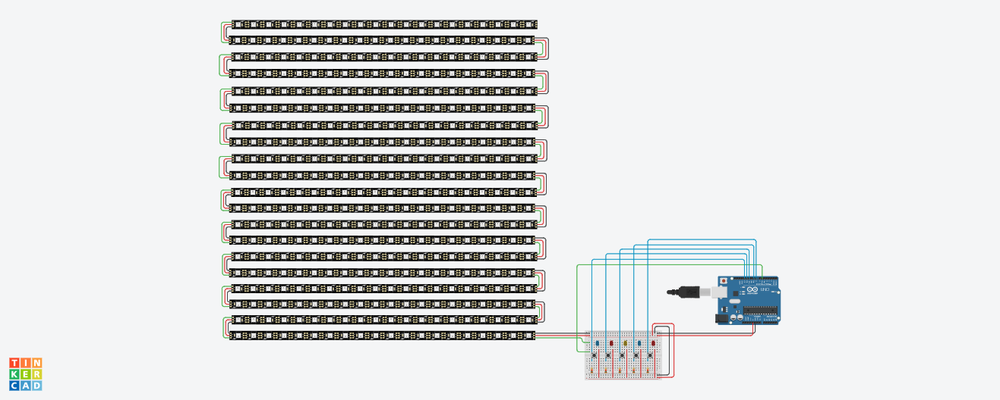

# Curso-IoT-Iniciantes 
# Alarme Noturno:
 
 
 
Código em blocos: 

 
<a href="Alarme_Noturno/Alarme_noturno.ino">Código em C++</a> 
 
# Protótipo Máscara Led v1.0
 
 
<a href="Prototipo_Mascara_Led_v1/prototipo_de_mascara_led_v1.ino">Código em C++</a> 
